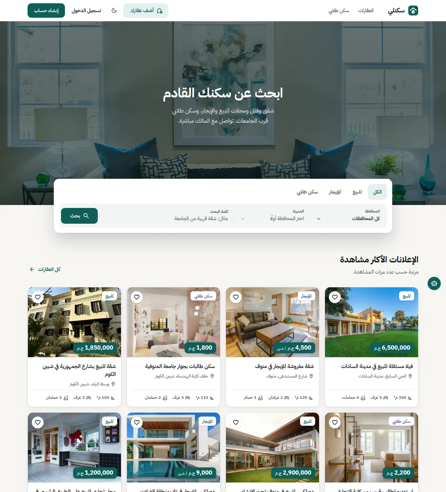
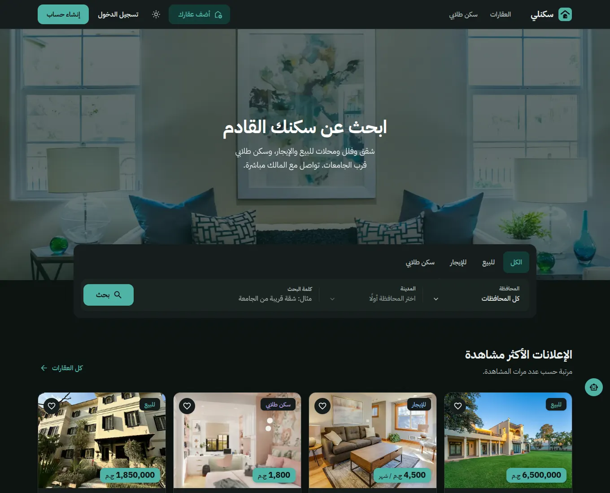
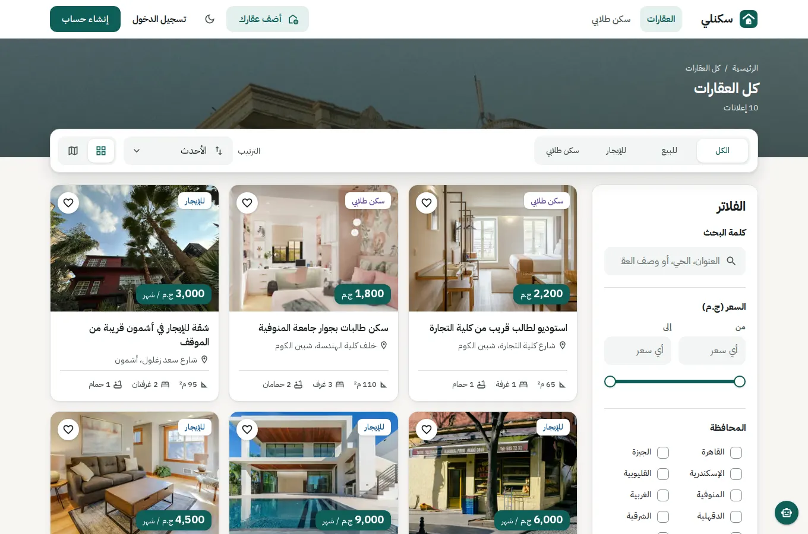
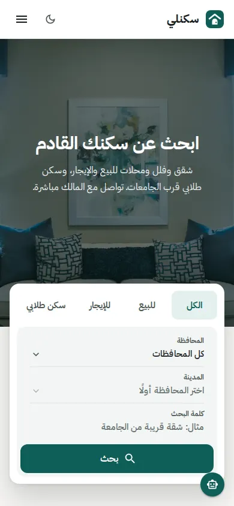
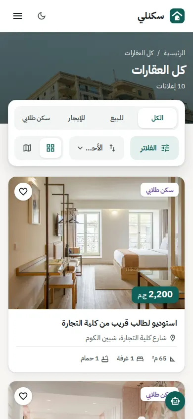
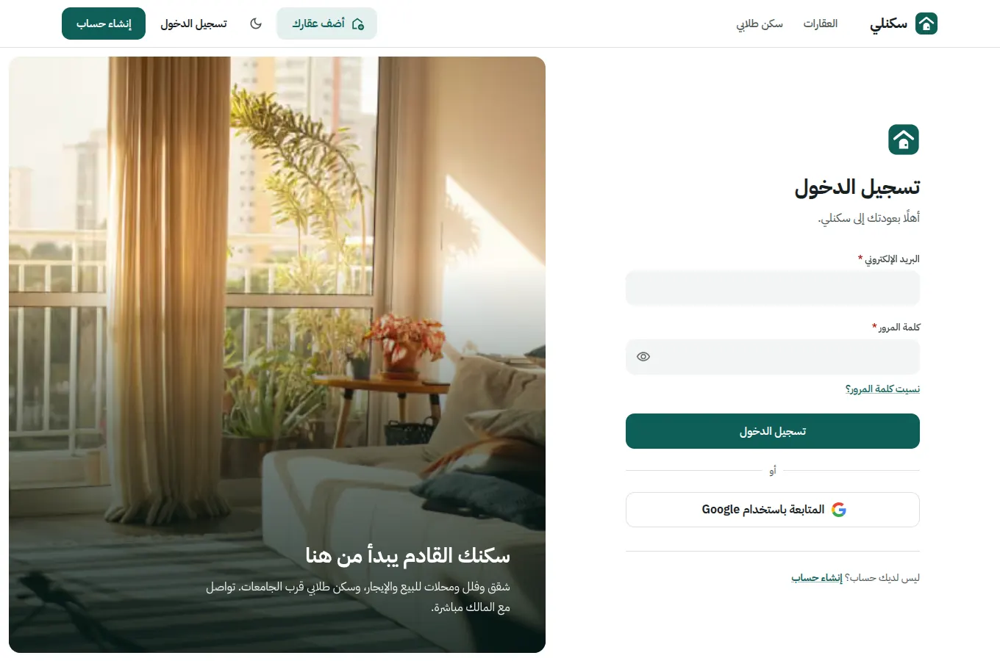
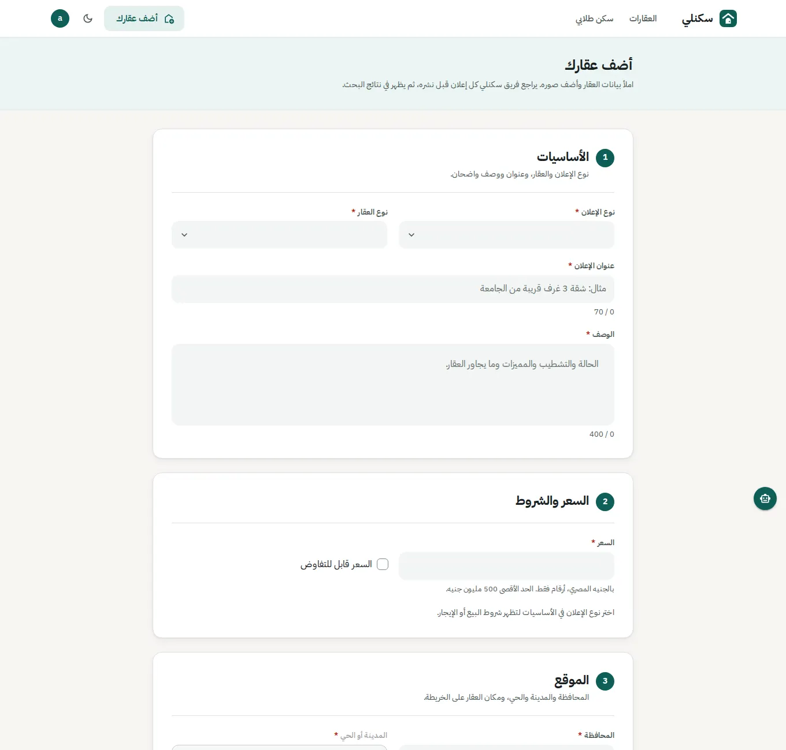
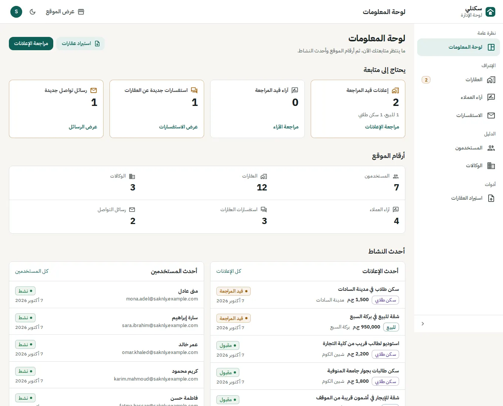
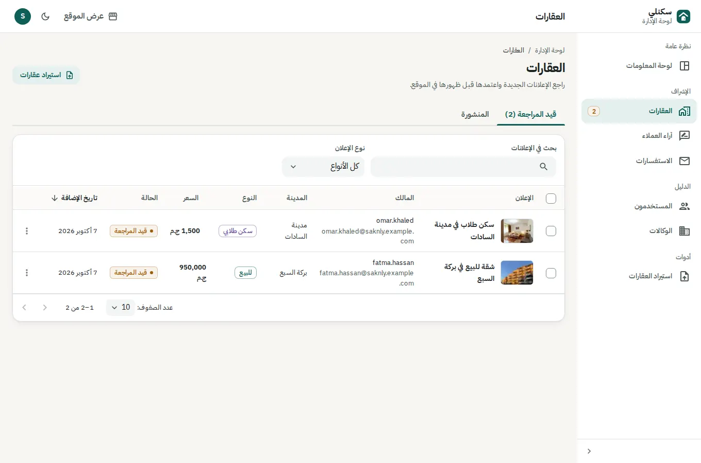

<div dir="rtl">

# سكنلي — Saknly

</div>

An Arabic-first property marketplace for Egypt: apartments, villas and shops for sale or rent, plus student housing near universities. Visitors search by governorate, city, type and price, save listings, and contact owners directly. Owners publish listings that the Saknly team reviews before they go live.

**Live:** https://saknly-ruddy.vercel.app · **API:** [Saknly-server](https://github.com/mahmoudadel810/Saknly-server)

## Screenshots

| Home | Home (dark mode) |
|---|---|
|  |  |

| Browse and filter | Mobile |
|---|---|
|  |   |

| Sign in | Publish a listing |
|---|---|
|  |  |

| Admin dashboard | Listing moderation |
|---|---|
|  |  |

## Features

- **Search and browse**: sale, rent and student-housing tabs; governorate and city; price and area ranges; rooms, amenities, sorting; grid or map view. Filters live in the URL, so results can be shared and the back button works.
- **Listing page**: photo gallery, price and key facts, location map, call / WhatsApp / email the owner, an inquiry form, and comments.
- **Accounts**: email sign-up with confirmation, Google sign-in, password reset, a wishlist, and "My account" with your listings and their review status.
- **Publishing**: a sectioned form with validation, a map picker and photo upload; drafts survive an expired session.
- **Admin**: a dashboard of what needs attention, listing moderation (approve, reject, bulk approve), and management of users, agencies, inquiries and reviews, plus bulk import from a Word document.
- **Chatbot**: answers questions about listings and prices (Gemini on the server).
- **Built for Arabic**: right-to-left layout throughout, light and dark mode, and responsive from phones to desktops.

## Tech stack

Next.js 15 (App Router) · React 18 · TypeScript · MUI 7 (CSS-variable colour schemes, RTL via `stylis-plugin-rtl`) · Tailwind CSS (layout only) · TanStack Query · axios · Leaflet · IBM Plex Sans Arabic.

## Getting started

Requirements: Node.js 20+ and a running [Saknly API](https://github.com/mahmoudadel810/Saknly-server).

```bash
npm install
# optional: create .env.local (see below) to point at your own API
npm run dev                  # http://localhost:3000
```

Environment variables (`.env.local`):

| Variable | Purpose | Default |
|---|---|---|
| `NEXT_PUBLIC_API_URL` | Base URL of the Saknly API | the hosted API |
| `NEXT_PUBLIC_TOKEN_PREFIX` | Prefix of the `Authorization` header expected by the API | `Saknly__` |

## Scripts

| Command | What it does |
|---|---|
| `npm run dev` | Start the development server |
| `npm run build` | Production build |
| `npm start` | Serve the production build |
| `npm run lint` | ESLint |
| `npm run type-check` | TypeScript check without emitting |

## Deployment

The `main` branch deploys automatically to Vercel. Set `NEXT_PUBLIC_API_URL` in the Vercel project if the API is not at its default address.

## Credits

Hero and page photos are from [Unsplash](https://unsplash.com/license); see [`public/images/hero/CREDITS.md`](public/images/hero/CREDITS.md).
